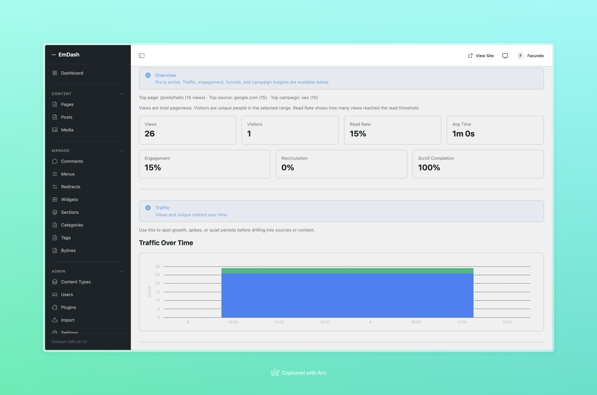
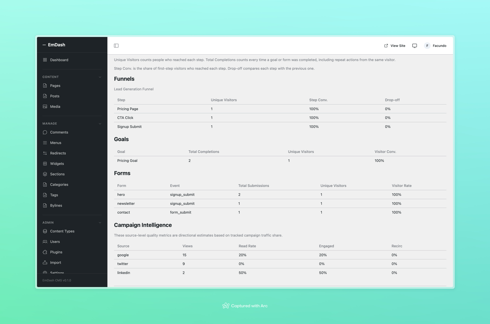

# em-analytics-hub

CMS-aware, portable, privacy-first analytics for [EmDash](https://github.com/emdash-cms/emdash).

Track pageviews, UTM campaigns, custom events, and more — segmented by route, template, and collection. Works on Cloudflare Workers and Node.js self-hosted.

<p align="center">
  
  
</p>

## Install

```bash
npm install em-analytics-hub
```

```ts
// astro.config.mjs
import emdash from "emdash/astro";
import { analyticsHub } from "em-analytics-hub";

export default defineConfig({
  integrations: [
    emdash({
      plugins: [analyticsHub()]
    })
  ]
});
```

Add the beacon component to your theme layout:

```astro
---
import AnalyticsBeacon from "em-analytics-hub/astro";
---

<AnalyticsBeacon />
```

## Features

### Free

- Dashboard inside EmDash admin
- Pageviews and unique visitors
- Top pages with template and collection segmentation
- Referrer breakdown
- UTM attribution (source, medium, campaign)
- Custom events with counts and trends
- 30-day data retention
- 1 site
- Works on Cloudflare and Node.js

### Pro

- Funnels
- Goals
- Forms analytics
- Campaign intelligence
- Custom event property breakdowns
- Period comparison
- Countries breakdown
- 365-day retention
- Extended date ranges
- Up to 3 sites per license

Goals and funnels can be configured from dedicated admin pages:

- `Analytics`
- `Goals`
- `Funnels`

## Custom Events

Track custom events from your theme or pages:

```js
window.emAnalytics.track("cta_click", { variant: "hero", page: "pricing" });
```

Events appear in the dashboard with counts and trend charts.

## UTM Tracking

UTM parameters are captured automatically from URLs:

```
https://yoursite.com/blog/post?utm_source=twitter&utm_medium=social&utm_campaign=spring2026
```

Source, medium, and campaign are captured automatically and feed the campaign insights shown in the dashboard.

## Template and Collection Metadata

Add meta tags to your theme layouts to enable template and collection segmentation:

```html
<meta name="em:template" content="blog-post" />
<meta name="em:collection" content="blog" />
```

## Privacy

- No cookies
- No fingerprinting
- No localStorage
- Daily-rotating IP hashes (cannot cross-match visitors across days)
- Honors Do Not Track (DNT)
- Bot and crawler filtering
- Configurable excluded paths and IPs

## Pro

One package, Pro unlocked with a valid license key.

1. Purchase a Pro license
2. Paste the key into the plugin settings in EmDash
3. Open the Analytics page — Pro features activate on this site
4. Configure goals and funnels from the plugin admin pages

You can also set `ANALYTICS_HUB_LICENSE_KEY` as an environment variable if you prefer managing licensing at deploy time.

## Settings

| Setting | Type | Description | Default |
|---------|------|-------------|---------|
| Pro License Key | Plugin setting | Lemon Squeezy license key for this site | Empty |
| `ANALYTICS_HUB_LICENSE_KEY` | Env var | Optional deploy-time fallback license key | Empty |
| Excluded Paths | Plugin setting | Comma-separated path prefixes to skip | `/_emdash/,/admin/` |
| Excluded IPs | Plugin setting | Comma-separated IPs to filter | Empty |
| Data Retention | Plugin setting | Days to keep raw events (Free: 30, Pro: 365) | 30 |

## License

MIT — see [LICENSE](./LICENSE).
